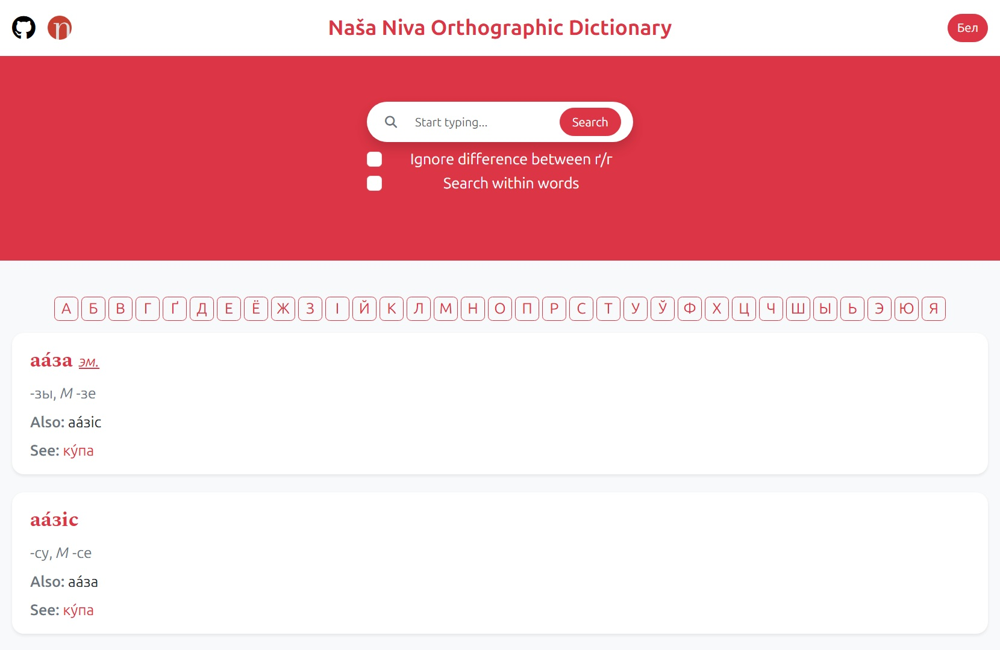

[Беларускаю](readme/README-by.md)


<!-- PROJECT LOGO -->
<div align="center">
  <a href="https://github.com/andreihar/nasa-niva-dict">
    
  </a>
  
# Naša Niva Dictionary


<!-- PROJECT SHIELDS -->
[![Contributors][contributors-badge]][contributors]
[![Licence][licence-badge]][licence]
[![LinkedIn][linkedin-badge]][linkedin]

**Orthographic Dictionary of Naša Niva**

A reconstructed Belarusian orthographic dictionary preserving classical Belarusian spelling, accessible through a modern web interface.

**[➤ Live Demo][demo]** •
[Report Bug][bug]

</div>


---


<!-- TABLE OF CONTENTS -->
<details open>
  <summary>Table of Contents</summary>
  <ol>
    <li>
      <a href="#about-the-project">About The Project</a>
    </li>
    <li><a href="#install">Install</a></li>
    <li>
      <a href="#features">Features</a>
      <ul>
        <li><a href="#dictionary">Dictionary</a></li>
        <ul>
          <li><a href="#sorter">Sorter</a></li>
        </ul>
        <li><a href="#browser">Browser</a></li>
        <ul>
          <li><a href="#search">Search</a></li>
          <li><a href="#search-options">Search Options</a></li>
          <li><a href="#localisation">Localisation</a></li>
        </ul>
      </ul>
    </li>
    <li><a href="#data">Data</a></li>
    <li><a href="#contributors">Contributors</a></li>
    <li><a href="#acknowledgements">Acknowledgements</a></li>
    <li><a href="#licence">Licence</a></li>
  </ol>
</details>


<!-- ABOUT THE PROJECT -->
## About The Project

This project is a reconstruction of the *Dictionary of the Belarusian Language* — an orthographic dictionary of the Belarusian language in its [classical spelling (Taraškievica)][taraskievica-wiki], originally prepared by the editorial team of «Naša Niva» in 2001. The dictionary was once available online via slounik.org and saw widespread use, but after its removal it became difficult to access and gradually disappeared from common use.

This version is based on a recovered CHM file, assembled by Uładzimier Katkoŭski from multiple RTF sources. The data has been converted into a structured CSV format and presented as a modern web application, preserving the original content while providing fast search, filtering, and navigation. The project serves both as a practical linguistic tool and as a digital preservation of an important resource for the study and use of classical Belarusian orthography.


<!-- INSTALL -->
## Install

Run the app locally:

```bash
$ cd browser
$ python -m http.server 8000
```

The website can be accessed through the URL `http://localhost:8000/`.


<!-- FEATURES -->
## Features

### Dictionary

The core of this project is a reconstructed version of the original dictionary, converted from a CHM (compiled HTML Help) file into a structured CSV format. During this process, the content was carefully extracted and reorganised to make it machine-readable and suitable for web use. The original CHM file is also included in the project.

Each dictionary entry is divided into the following fields:

- `word` — the main entry  
- `clarification` — additional explanation or context  
- `classification` — part of speech  
- `endings` — grammatical endings (e.g. noun declension, verb conjugation)  
- `and` — synonyms or related words  
- `look` — recommended or preferred form  
- `from` — origin of the word  
- `vars` — related words of different parts of speech  
- `but` — exceptions or special cases  

This structure was not present in the original CHM file and was introduced during the conversion process. As a result, some entries may contain minor inconsistencies due to the largely manual classification.

The dictionary data is organised in the `dict` folder into three separate files:
- `abbreviations.csv`
- `proper_names.csv`
- `other.csv`

#### Sorter

The project includes a Python-based utility for working with the dictionary data. The sorter provides functionality to alphabetically sort dictionary entries, and combine multiple CSV files into a single `dict.csv` file used by the web application.

### Browser

The browser is a web-based interface that allows users to explore and interact with the dictionary in a fast and intuitive way.

<p align="center">

</p>

#### Search

Users can search for words using a search bar (full-text search), or an alphabet navigation by selecting a specific letter. By default, search matches words from the beginning.

#### Search Options

The browser includes configurable search options:
- **Search within words** — allows matching substrings, not only prefixes  
- **Ignore difference between ґ/г** — improves accessibility for users without the `ґ` character on their keyboard  

#### Localisation

The interface supports both Belarusian and English languages, allowing users to switch between them dynamically.


<!-- DATA -->
## Data

- [Naša Niva Dictionary][dictionary] (via [pravapis.org][dictionary-via])


<!-- CONTRIBUTORS -->
## Contributors

- Andrei Harbachov ([GitHub][andrei-github] · [LinkedIn][andrei-linkedin])


<!-- ACKNOWLEDGEMENTS -->
## Acknowledgements

- [Naša Niva][nasaniva] editorial team — publishing the original orthographic dictionary of the Belarusian language
- [Uładzimier Katkoŭski][katkouski] (rydel23) — compiling the dictionary into the CHM format from multiple RTF sources, making its preservation possible


<!-- LICENCE -->
## Licence

Because Naša Niva Dictionary is MIT-licensed, any developer can essentially do whatever they want with it as long as they include the original copyright and licence notice in any copies of the source code. Note, that the data used by the package is licensed under a different copyright.


<!-- MARKDOWN LINKS -->
<!-- Badges and their links -->
[contributors-badge]: https://img.shields.io/badge/Contributors-1-44cc11?style=for-the-badge
[contributors]: #contributors
[licence-badge]: https://img.shields.io/github/license/andreihar/nasa-niva-dict.svg?color=000000&style=for-the-badge
[licence]: LICENCE
[linkedin-badge]: https://img.shields.io/badge/LinkedIn-0077B5?style=for-the-badge&logo=linkedin&logoColor=white
[linkedin]: https://www.linkedin.com/in/andrei-harbachov/

<!-- Technical links -->
[demo]: https://nasaniva.andreihar.com/
[bug]: https://github.com/andreihar/nasa-niva-dict/issues
[dictionary]: https://pravapis.org.dyskurs.be/articles/slouniknn/
[dictionary-via]: https://pravapis.org.dyskurs.be/
[katkouski]: https://en.wikipedia.org/wiki/U%C5%82adzimir_Katko%C5%ADski
[nasaniva]: https://nashaniva.com/

<!-- Other links -->
[taraskievica-wiki]: https://en.wikipedia.org/wiki/Tara%C5%A1kievica

<!-- Socials -->
[andrei-linkedin]: https://www.linkedin.com/in/andrei-harbachov/
[andrei-github]: https://github.com/andreihar