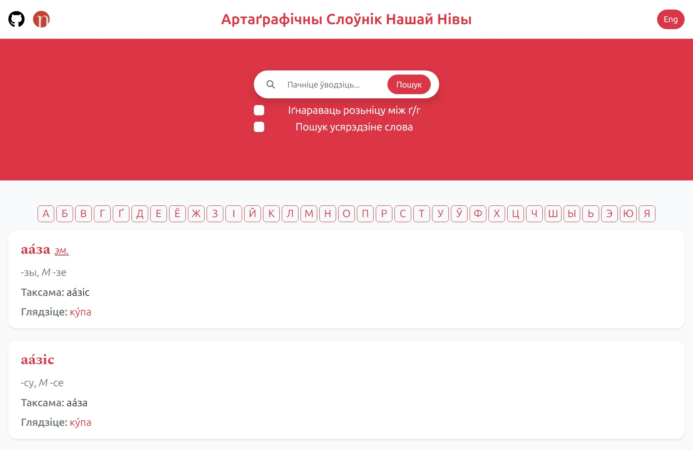

[English](../README.md)


<!-- PROJECT LOGO -->
<div align="center">
  <a href="https://github.com/andreihar/nasa-niva-dict">
    
  </a>
  
# Слоўнік Нашай Нівы


<!-- PROJECT SHIELDS -->
[![Contributors][contributors-badge]][contributors]
[![Licence][licence-badge]][licence]
[![LinkedIn][linkedin-badge]][linkedin]

**Артаґрафічны Слоўнік Нашай Нівы**

Рэканструяваны артаґрафічны слоўнік беларускае мовы, які захоўвае клясычны беларускі правапіс, даступны праз сучасны інтэрфэйс.

**[➤ Жывая дэманстрацыя][demo]** •
[Паведаміць пра памылку][bug]

</div>


---


<!-- TABLE OF CONTENTS -->
<details open>
  <summary>Зьмест</summary>
  <ol>
    <li>
      <a href="#пра-праект">Пра праект</a>
    </li>
    <li><a href="#усталяваньне">Усталяваньне</a></li>
    <li>
      <a href="#асаблівасьці">Асаблівасьці</a>
      <ul>
        <li><a href="#слоўнік">Слоўнік</a></li>
        <ul>
          <li><a href="#сартавальнік">Сартавальнік</a></li>
        </ul>
        <li><a href="#аглядальнік">Аглядальнік</a></li>
        <ul>
          <li><a href="#пошук">Пошук</a></li>
          <li><a href="#парамэтры-пошуку">Парамэтры пошуку</a></li>
          <li><a href="#лякалізацыя">Лякалізацыя</a></li>
        </ul>
      </ul>
    </li>
    <li><a href="#зьвесткі">Зьвесткі</a></li>
    <li><a href="#саўдзельнікі">Саўдзельнікі</a></li>
    <li><a href="#падзякі">Падзякі</a></li>
    <li><a href="#ліцэнзія">Ліцэнзія</a></li>
  </ol>
</details>


<!-- ABOUT THE PROJECT -->
## Пра праект

Гэты праект ёсьць рэканструкцыяю *Слоўніка беларускай мовы* — артаґрафічнага слоўніка беларускае мовы ў яе [клясычным правапісе (Тарашкевіцы)][taraskіevіca-wіkі], першапачаткова падрыхтаванага рэдакцыяю «Нашае Нівы» ў 2001 року. Слоўнік калісьці быў даступны ў інтэрнэце праз slounіk.org і шырока ўжываўся, але пасьля яго выдаленьня доступ стаў цяжкадаступным і паступова зьнік з агульнага ўжытку.

Гэтая вэрсія заснаваная на адноўленым CHM файле, сабраным Уладзімерам Каткоўскім зь некалькіх крыніцаў RTF. Зьвесткі былі пераўтвораныя ў структураваны фармат CSV і прадстаўленыя ў выглядзе сучаснае вэб-прылады, захоўваючы арыґінальны зьмест і забясьпечваючы хуткі пошук, фільтраваньне ды навіґацыю. Праект служыць як практычным лінґвістычным інструмэнтам, так і лічбавым захаваньнем важнага рэсурсу для вывучэньня ды ўжываньня клясычнага беларускага правапісу.


<!-- INSTALL -->
## Усталяваньне

Каб запусьціць прыладу лякальна:

```bash
$ cd browser
$ python -m http.server 8000
```

Доступ да вэб-сайту можна атрымаць па URL-адрасе `http://localhost:8000/`.


<!-- FEATURES -->
## Асаблівасьці

### Слоўнік

Ґрунтам гэтага праекту ёсьць рэканструяваная вэрсія арыґінальнага слоўніка, пераўтвораная з CHM файла (скампіляваная HTML-даведка) у структураваны фармат CSV. Падчас гэтага працэсу зьмест быў уважна выняты ды рэарґанізаваны, каб зрабіць яго машыначытэльным ды прыдатным для выкарыстаньня ў інтэрнэце. Арыґінальны CHM файл таксама ўлучаны ў праект.

Кожны слоўнікавы запіс падзелены на наступныя палі:

- `word` — асноўны запіс
- `clarification` — дадатковае тлумачэньне альбо кантэкст
- `clasification` — часьціна мовы
- `endings` — ґраматычныя канчаткі (напрыклад, склон назоўніка, спражэньне дзеяслова)
- `and` — сынонімы альбо роднасныя словы
- `look` — рэкамэндаваная альбо пераважная форма
- `from` — паходжаньне слова
- `vars` — роднасныя словы розных часьцінаў мовы
- `but` — выключэньні альбо асаблівыя выпадкі

Гэтае структуры не было ў арыґінальным CHM файле і была ўведзеная падчас працэсу пераўтварэньня. У выніку, некаторыя запісы могуць зьмяшчаць нязначныя непасьлядоўнасьці празь пераважна ручную клясыфікацыю.

Зьвесткі слоўніка арґанізаваныя ў тэчцы `dict` у тры асобныя файлы:
- `abbreviations.csv`
- `proper_names.csv`
- `other.csv`

#### Сартавальнік

Праект улучае ўтыліту на ґрунце Python для працы зь зьвесткамі слоўніка. Сартавальнік забясьпечвае функцыянальнасьць альфабэтнага сартаваньня слоўнікавых запісаў ды аб’яднаньня некалькіх CSV файлаў у адзін файл `dіct.csv`, які выкарыстоўваецца вэб-прыладаю.

### Аглядальнік

Аглядальнік ёсьць вэб-інтэрфэйсам, які дазваляе карыстальнікам хутка й інтуітыўна зразумела дасьледаваць слоўнік ды ўзаемадзейнічаць зь ім.

<p align="center">

</p>

#### Пошук

Карыстальнікі могуць шукаць словы з дапамогаю паліцы пошуку (поўнатэкставы пошук) альбо альфабэтнай навіґацыі, абіраючы пэўную літару. Па змаўчаньні пошук супадае з словамі з пачатку.

#### Парамэтры пошуку

Аглядальнік мае наладжвальныя парамэтры пошуку:
- **Пошук усярэдзіне словаў** — дазваляе знаходзіць супадзеньні ня толькі ў прэфіксах, але і ў падрадках
- **Іґнараваць розьніцу між ґ/г** — паляпшае даступнасьць для карыстальнікаў, якія ня маюць сымбалю `ґ` на клявіятураы

#### Лякалізацыя

Інтэрфэйс падтрымлівае як беларускую, так і анґельскую мовы, што дазваляе карыстальнікам дынамічна перамыкацца між імі.


<!-- DATA -->
## Зьвесткі

- [Слоўнік Нашай Нівы][dictionary] (праз [pravapis.org][dictionary-via])


<!-- CONTRIBUTORS -->
## Саўдзельнікі

- Andrei Harbachov ([GitHub][andrei-github] · [LinkedIn][andrei-linkedin])


<!-- ACKNOWLEDGEMENTS -->
## Падзякі

- Супрацоўнікі выдаўніцтва [Наша Ніва][nasaniva] — выданьне арыґінальнага артаґрафічнага слоўніка беларускае мовы
- [Уладзімер Каткоўскі][katkouski] (rydel23) — кампіляцыя слоўніка ў фармат CHM зь некалькіх крыніцаў RTF, што дазволіла яго захаваньне


<!-- LICENCE -->
## Ліцэнзія

Паколькі Слоўнік Нашай Нівы распаўсюджваецца пад ліцэнзіяю MІT, хоць які распрацоўнік можа рабіць зь ім усё, што заўгодна, пакуль ён улучае арыґінальнае паведамленьне пра аўтарскія правы ды ліцэнзію ў хоць якія копіі зыходнага коду. Зьвярнеце ўвагу, што зьвесткі, што выкарыстоўваюцца пакункам, ліцэнзаваныя пад іншым аўтарскім правам.


<!-- MARKDOWN LINKS -->
<!-- Badges and their links -->
[contributors-badge]: https://img.shields.io/badge/Contributors-1-44cc11?style=for-the-badge&label=Саўдзельнікі
[contributors]: #contributors
[licence-badge]: https://img.shields.io/github/license/andreihar/nasa-niva-dict.svg?color=000000&style=for-the-badge&label=Ліцэнзія
[licence]: LICENCE
[linkedin-badge]: https://img.shields.io/badge/LinkedIn-0077B5?style=for-the-badge&logo=linkedin&logoColor=white
[linkedin]: https://www.linkedin.com/in/andrei-harbachov/

<!-- Technical links -->
[demo]: https://nasaniva.andreihar.com/
[bug]: https://github.com/andreihar/nasa-niva-dict/issues
[dictionary]: https://pravapis.org.dyskurs.be/articles/slouniknn/
[dictionary-via]: https://pravapis.org.dyskurs.be/index_be/
[katkouski]: https://be-tarask.wikipedia.org/wiki/%D0%A3%D0%BB%D0%B0%D0%B4%D0%B7%D1%96%D0%BC%D0%B5%D1%80_%D0%9A%D0%B0%D1%82%D0%BA%D0%BE%D1%9E%D1%81%D0%BA%D1%96
[nasaniva]: https://nashaniva.com/

<!-- Other links -->
[taraskievica-wiki]: https://be-tarask.wikipedia.org/wiki/%D0%91%D0%B5%D0%BB%D0%B0%D1%80%D1%83%D1%81%D0%BA%D1%96_%D0%BA%D0%BB%D1%8F%D1%81%D1%8B%D1%87%D0%BD%D1%8B_%D0%BF%D1%80%D0%B0%D0%B2%D0%B0%D0%BF%D1%96%D1%81

<!-- Socials -->
[andrei-linkedin]: https://www.linkedin.com/in/andrei-harbachov/
[andrei-github]: https://github.com/andreihar